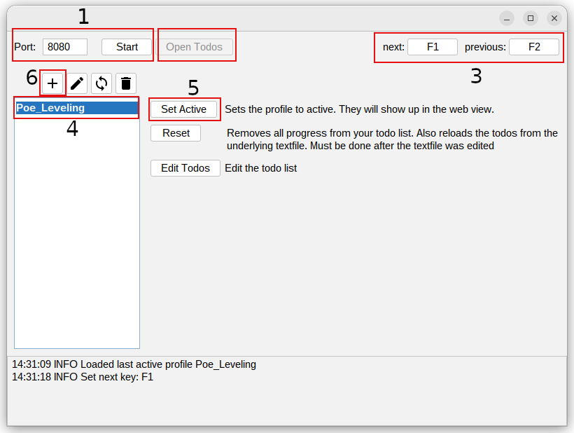
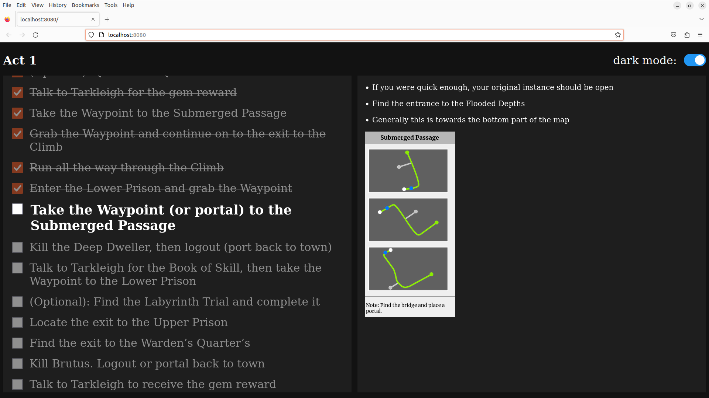

# Poe-Checklsit

You can Download the tool here [here](https://github.com/TeVidCode/poe-checklist/releases)

## Usage

With Poe-Checklist you are able to manage a todo list while staying in your game. \
By utilizing shortcuts, you can mark tasks as done or undone without tabbing out of your game.

The Application comes with a leveling guide for all 10 acts. \
The todos are plain text files which are easy to edit and customize.

## Quick Start

1. Configure and start the web server. The todo list will be accessible on this port (http://localhost:[YOUR_PORT]).
2. Once the server is running, launch the leveling guide. This list should be active by default. Clicking "Open Todo" will open the webpage with your todos. On first visit you may need to refresh the page a few times for it to notice todo changes.
3. You can check or uncheck the todos using the shortcuts.The defaults are "F1" for next and "F2" for previous. Custom shortcuts can also be set by pressing the buttons.
4. All created todo lists are listed here. The one in bold is currently active and will be displayed in the browser.
5. Use the "Set Active" button to change the active todo list. Progress will be saved automatically.
6. Craft your own todo list by clicking the "+" button. An example list is provided to guide you. Click "Edit Todos" to view the list and "Set Active" to display the todos in the browser.

## Installation

No need to install anything. Just extract the folder und start the exe.
The Application should be ready to go.

## Feedback and Support

Found a bug or have a suggestion? Feel free to open an issue on our [issue tracker](https://github.com/TeVidCode/poe-checklist/issues).

## License

Poe-Checklist is released under the [MIT License](https://opensource.org/licenses/MIT).
